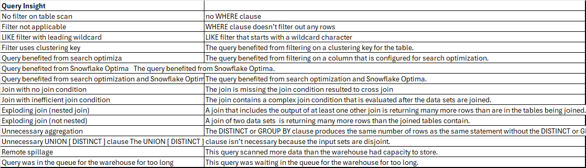

5.0 Data Transformations
Friday, November 21, 2025
9:42 PM

**COPY Command :**

Data Transformation options in COPY command:
Column reordering
Column omission
Casts
Truncating text strings that exceed the target column length.

Validation mode Options:
1\. RETURN_ERRORS
This mode scans the data files and reports any validation errors found.
It does not load any data into the table. Using RETURN_ERRORS helps in identifying initial issues, like type mismatches or missing columns, without attempting a full data load. It’s useful for catching a sample of errors to address before proceeding with an actual load.

2\. RETURN_ALL_ERRORS
instead of stopping at the first few errors, RETURN_ALL_ERRORS continues to scan the entire file and returns all errors found.

3\. RETURN_n_ROWS
validates the data files and returns up to the specified number of rows that would have been loaded, without actually loading them into the target table.

These VALIDATION_MODE options do not support COPY statements that involve transformation

- bulk data load history by COPY command is stored in the metadata of the target table for 64 days

**SQL Functions :**

Scalar functions process individual values, returning a single result per input.

Aggregate functions compute a single result from multiple input rows, such as totals or averages.

Window functions perform calculations across a set of table rows related to the current row, useful for tasks like ranking or running totals.

System functions provide information about the system, session, or database objects.

Table functions return a set of rows, often used to process semi-structured data or generate series.

User-Defined Functions (UDFs) enable users to create custom functions in languages like SQL, JavaScript, or Python, extending Snowflake's capabilities.

**UDF** :
- Single query which return a value
- SQL, JavaScript, Java, Python, and Scala

STAGE_DIRECTORY_FILE_REGISTRATION_HISTORY :
metadata history for a directory table - files added/removed and errors details

AUTO_REFRESH_REGISTRATION_HISTORY
query the history of data files registered in the metadata of specified objects and the credits billed for these operations

BUILD_STAGE_FILE_URL
designed to help generate the FILE URL to access unstructured data files within Snowflake.

**URL** :
File URL:
- URL that identifies the database, schema, stage, and file path to a set of files.
- A role that has sufficient privileges on the stage can access the files.
- Ideal for custom applications that require access to unstructured data files.
- It is permanent

Scoped URL:
- Encoded URL that permits temporary access to a staged file without granting privileges to the stage.
- The URL expires when the persisted query result period ends (i.e., the results cache expires), which is currently 24 hours.
- Ideal for use in custom applications, providing unstructured data to other accounts via a share, or for downloading and ad hoc analysis of unstructured data via Snowsight.
- user who generated the scoped URL can use the URL to access the referenced file

Pre-signed URL:
- Simple HTTPS URL used to access a file via a web browser.
- A file is temporarily accessible to users via this URL using a pre-signed access token.
- The expiration time for the access token is configurable.Length of time specified in the expiration_time argument.
- Ideal for business intelligence applications or reporting tools that need to display unstructured file contents.

**FLATTEN** function:
to convert semi-structured data, such as arrays or objects, into a relational format by producing a lateral view.
RECURSIVE =\> TRUE - recursive expansion of all nested sub-elements
OUTER =\> FALSE - omits non expandable elements
OUTER =\> TRUE - rows with non-expandable elements (eg :empty arrays) included in the output with NULL values
SELECT \* FROM TABLE(FLATTEN(input =\> parse_json('\[{"a": {"b": \[1, 2\]}}, {"a": {"b": \[3, 4\]}}\]'), RECURSIVE =\> TRUE)) f;

**HyperLogLog** is the algorithm used by Snowflake to estimate the approximate number of distinct values in a data set.
**Snowflake SQL AP**I supports Oauth, and Key Pair authentication.

Transformation : 

    FLATTEN 	OUTER => FALSE - Omit
        OUETR => TRUE - Null value
        RECURCIVE => TRUE - sub-elements recursively
        RECURCIVE => FALSE - Only one
        LATERAL  allows joining information from outside the object being flattened with the flattened data.
            

<B> **OPTIMIZATION** <B>
- SNOWFLAKE.ACCOUNT_USAGE.QUERY_INSIGHTS

ACCOUNT_USAGE Schema
 - QUERY_HISTORY view has Last 365 days 
 - ACCESS_HISTORY DB objects accessed information 
 - LOGIN_HISTORY 
 - COPY_HISTORY  to track load activity from staged files into Snowflake tables.  

INFORMATION_SCHEMA 
(1) Views for all objects contained in the database, as well as views for account-level objects (roles, warehouses, databases)
(2) Table functions for historical and usage data across the account.

FUNCTIONS:
-STATEMENT_QUEUED_TIMEOUT_IN_SECONDS   -  timeout for queued statements waiting for warehouse resources
-STATEMENT_TIMEOUT_IN_SECONDS controls execution time after a query starts running, not queue time
SYSTEM$GLOBAL_ACCOUNT_SET_PARAMETER : Account & Database replictaion, Client Redirect (Set by OrgAdmin)
CREATE SECURITY INTEGRATION is the initial step for setting up federated authentication like SAML 2.0 for SSO.
 IMPORTED PRIVILEGES is the specific privilege required to delegate Data Exchange administrative tasks, including showing categories. 
DATA_RETENTION_TIME_IN_DAYS can be set at the table level for Time Travel
SYSTEM$CLUSTERING_INFORMATION.average_overlaps : The average number of micro-partitions which contain overlapping value ranges.
SHOW MANAGED ACCOUNTS command will view all the reader accounts that have been created for an account.
MAX_DATA_EXTENSION_TIME_IN_DAYS  prevents stream from becoming stale by allowing more time to consume change data   
OBJECT_CONSTRUCT relational table into JSON format
